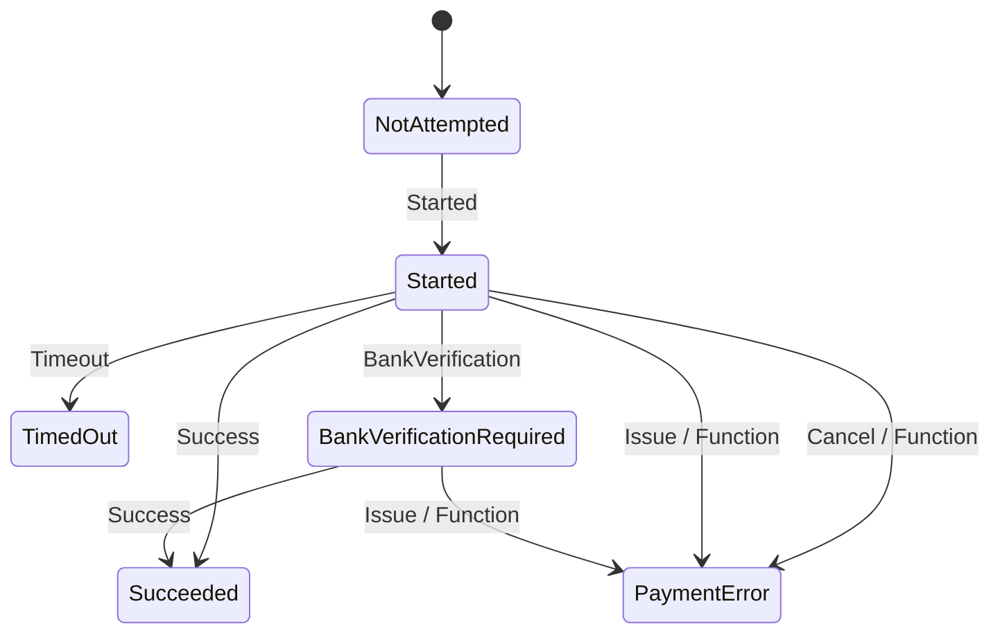
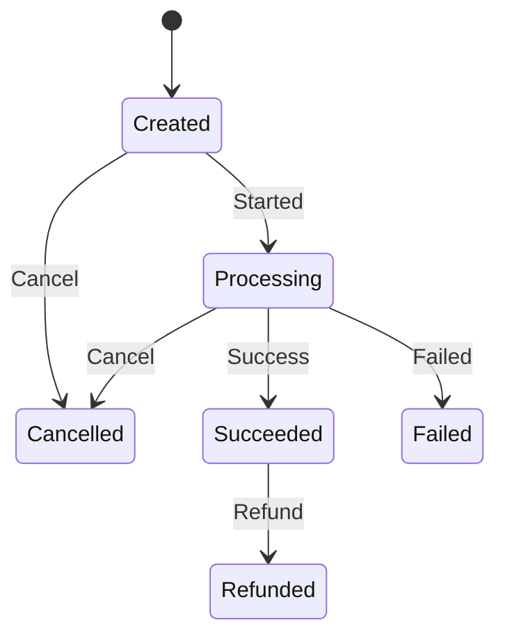

# Open Payment Mock

OpenPaymentMock is a third-party payment provider designed to simulate payment processing in a secure and reliable manner. It is ideal for developers and teams who need a lightweight, mock implementation of payment gateways for testing, integration, or prototyping without the complexity or costs of interacting with real payment providers.

## State Machines

### Payment attempt

### Payment situation

## Contributing

We welcome contributions! 