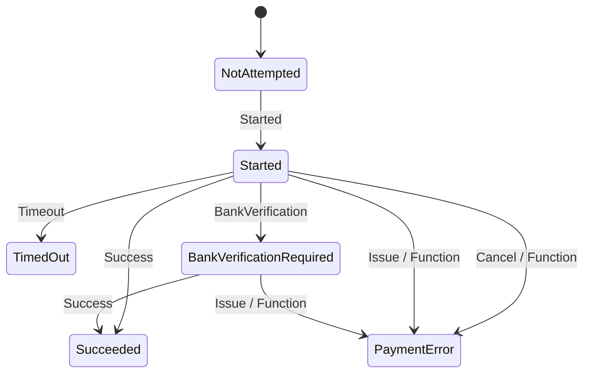
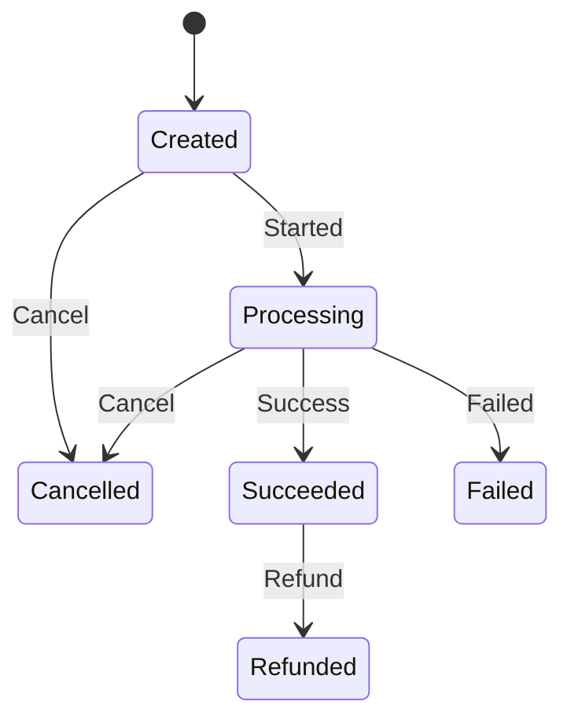

# Open Payment Mock

[](https://github.com/skornel02/OpenPaymentMock/actions/workflows/docker-build-push.yml)

OpenPaymentMock is a third-party payment provider designed to simulate payment processing in a secure and reliable manner. It is ideal for developers and teams who need a lightweight, mock implementation of payment gateways for testing, integration, or prototyping without the complexity or costs of interacting with real payment providers.

## Getting started

### Docker installation

The easiest way to get started with OpenPaymentMock is to use Docker. You can use the following `docker-compose.yml` file to start the OpenPaymentMock server:

```yaml	
services:
  openmockpayment:
    image: ghcr.io/skornel02/openpaymentmock:main
    container_name: openpaymentmock
    restart: always
    environment:
      ConnectionStrings__Sqlite: Data Source=/app/db/OpenPaymentMock.db
      Application__ApplicationUrl: http://your-openmockpayment-instance.local:8080
      Admin__ApiKey: AdminApiKey
    volumes:
      - opm-db:/app/db/
    ports:
      - 8080:8080

volumes:
  opm-db:
```

Please replace the environment variables with your own values. 

You can then start the OpenPaymentMock server and the server will start on port 8080. 

You can then access the admin UI at `http://your-openmockpayment-instance.local:8080/admin`.

### Configuration

You can configure the OpenPaymentMock server using environment variables. The following environment variables are available:

|  Property                         |  Description                          |
|-----------------------------------|---------------------------------------|
| ConnectionStrings__Sqlite         | This is the path to the Sqlite database file|
| Application__ApplicationUrl       | This is the URL of the OpenPaymentMock server. This is used to generate the callback URL for payment attempts.|
| Admin__ApiKey                     | This is the API key used to access the admin UI.|


## Current features

- **Payment Admin UI**

The payment admin UI allows admins to create, view, and manage partners and their access keys. The admins can also create new payment situations and view the details of existing payment situations.

- **Consumer UI**

The consumer UI allows users to simulate a payment attempt. Users can enter their payment details and submit the payment attempt or select temporary or permanent payment issues.

- **Partner API**

The partner API allows partners to create new payment situations, query the status of a payment situation, and update the status of a payment situation.

- **Payment callback**

The payment callback will allow users to receive a callback when a payment attempt has been processed. The callback will include the payment situation ID, the secret given by the partner and the status of the payment attempt.

## Features to be added

- **Partner UI**

The partner query UI will allow users to query the status of a payment attempt using the payment situation ID and their partner key.

- **Callback verification**

The callback verification will allow users to verify the authenticity of the callback using the secret given by the partner.

- **Payment client secret**

The payment client secret will allow users to authenticate themselves when making a payment attempt. This makes it more secure than the sequentially generated payment situation ID.

- **Payment situation refund**

The payment situation refund will allow users to refund a payment situation that has been successfully processed.


## Payment flow

### Payment state machines

#### Payment attempt



#### Payment situation



## Contributing

We welcome contributions! 