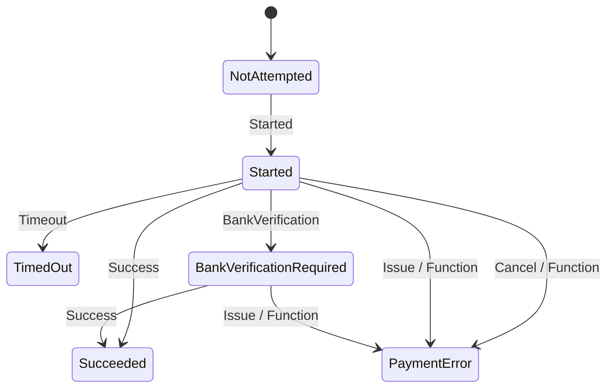
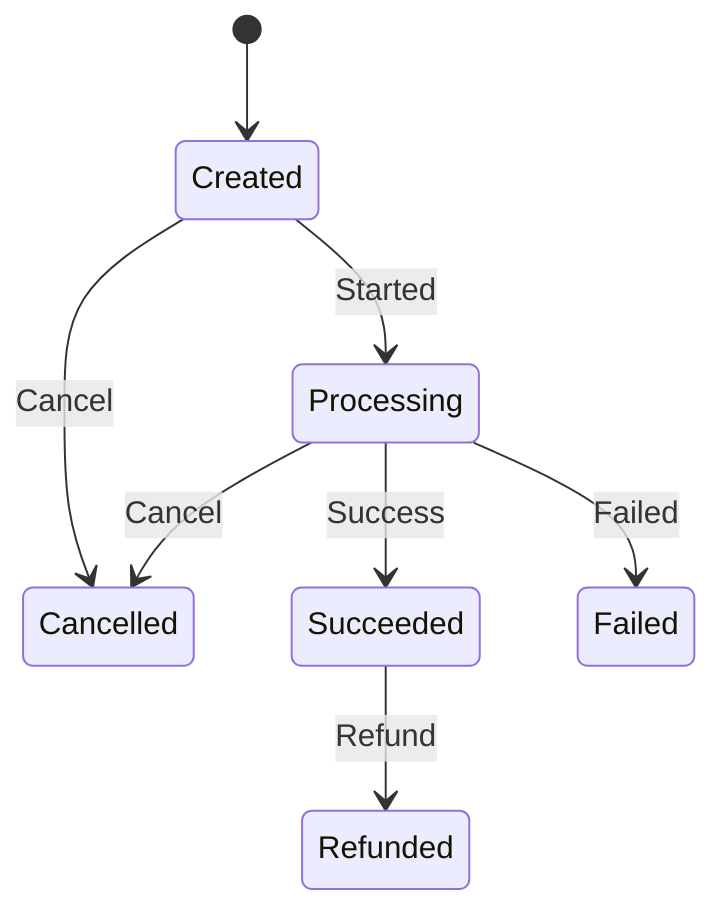

# Open Payment Mock

OpenPaymentMock is a third-party payment provider designed to simulate payment processing in a secure and reliable manner. It is ideal for developers and teams who need a lightweight, mock implementation of payment gateways for testing, integration, or prototyping without the complexity or costs of interacting with real payment providers.

## Getting started

### Docker installation

The easiest way to get started with OpenPaymentMock is to use Docker. You can run the following command to start the OpenPaymentMock server:

```bash
docker run -p 8080:8080 openpaymentmock/openpaymentmock
```

This will start the OpenPaymentMock server on port 8080. You can then access the admin UI at `http://localhost:8080/admin`.

## Current features

- **Payment Admin UI**

The payment admin UI allows admins to create, view, and manage partners and their access keys. The admins can also create new payment situations and view the details of existing payment situations.

- **Consumer UI**

The consumer UI allows users to simulate a payment attempt. Users can enter their payment details and submit the payment attempt or select temporary or permanent payment issues.

- **Partner API**

The partner API allows partners to create new payment situations, query the status of a payment situation, and update the status of a payment situation.

## Features to be added

- **Payment callback**

The payment callback will allow users to receive a callback when a payment attempt has been processed. The callback will include the payment situation ID, the secret given by the partner and the status of the payment attempt.

- **Partner UI**

The partner query UI will allow users to query the status of a payment attempt using the payment situation ID and their partner key.

## Payment flow

### Payment state machines

#### Payment attempt



#### Payment situation



## Contributing

We welcome contributions! 